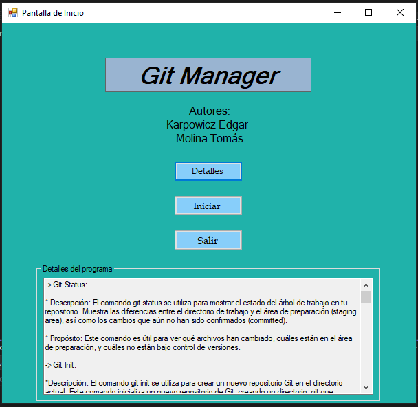
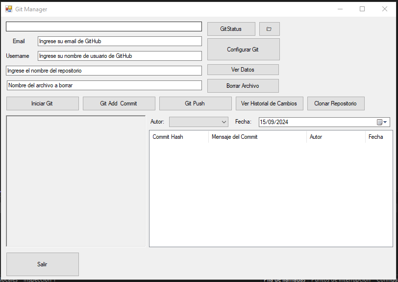
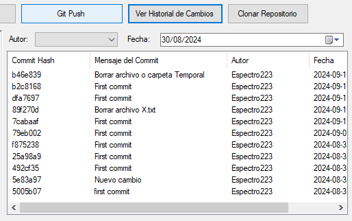
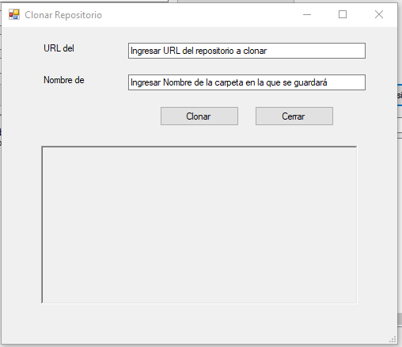

# 🔨 **Prototipo de Git Manager - Primer Parcial de PGE**

¡Bienvenido/a al repositorio del **Primer Parcial** de la materia **Programación Genérica y Eventos (PGE)**! 🌟

Este proyecto se centra en la creación de un **prototipo** que implementa una **UI** para el software de **Git**. A través de este prototipo, implementaremos y facilitaremos la interacción del usuario con la aplicación de Git para interactuar remotamente con su repositorio de **Github** de manera local, todo implementado utilizando **callbacks**, **Paint Event** y **Manejo de Errores**. Al ser un prototipo no se abarca todos los aspectos que ofrece la aplicación de Git, sin embargo, se han implementado los que consideramos las funcionalidades más importantes que puede ofrecer Git para alguien que está iniciandose a usar esta herramienta.

## 🚀 **Ejecución del Proyecto**

1. Descargar e instalar el software de GIT -> https://git-scm.com/downloads.
2. Clona este repositorio.
3. Abrir el proyecto en **Visual Studio** con la extensión de **C++/CLI (.NET Framework)**.
4. Ejecuta el proyecto para experimentar el prototipo.
5. Completar los campos necesarios para experimentar correctamente las funcionalidades implementadas.

## 🎨 **Capturas de Pantalla**

*(Inserta aquí capturas de pantalla del prototipo en acción)*

---

**¡Gracias por explorar este proyecto!** Si te ha gustado o lo has encontrado útil, considera dejar una ⭐ en el repositorio.
